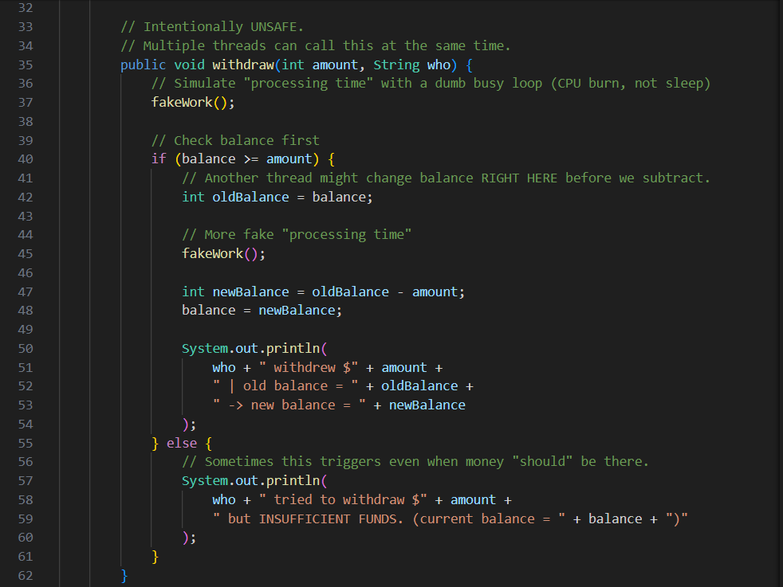
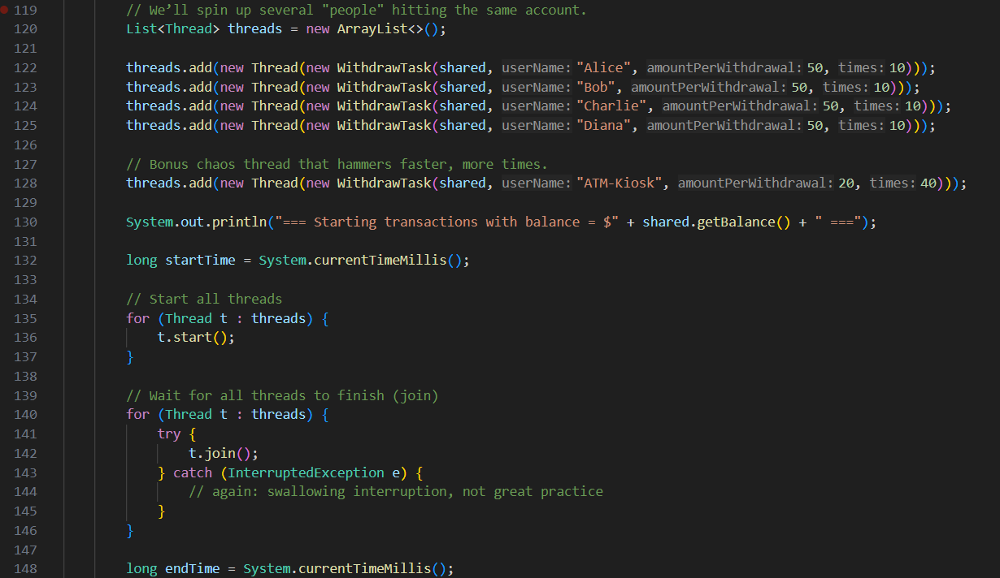
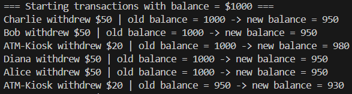
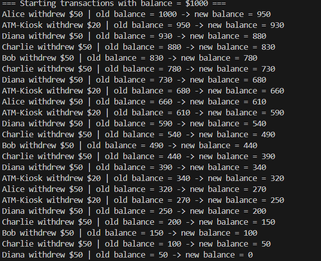

There are a couple issues with the code provided, with the major bug being the race condition between the different threads and the withdraw() method. Since the threads run at the same time, they withdraw in a random order due to the "fakeWork" method (which makes them do random math to delay their actions). which leads to some threads interrupting each other's processes

Since this happens you will get scenarios where threads misread the amounts in the account, which leads to incorrect results

Another big issue is with the "fakeWork" method. Instead of just delaying time between threads, this method makes the cpu calculate 100,000 squareroots without saving the answers. This wastes time and energy, causing other actions to be slowed in the process.

My proposed solutions are to use the "syncronized" keyword in the withdraw method that way only one thread can access it at a time (preventing overlaps). My next solution is to replace the "fakeWork" method with a try() block using Thread.sleep() to not waste resources. I will also import java.util.Random to make the thread withdrawals random (simulating a real bank account).

I've placed the fixed code in a separate file "BankSimulationSolution.java"

## Output changes

The output now has correct values.

The randomization of threads does not interfere with balance accuracy.

